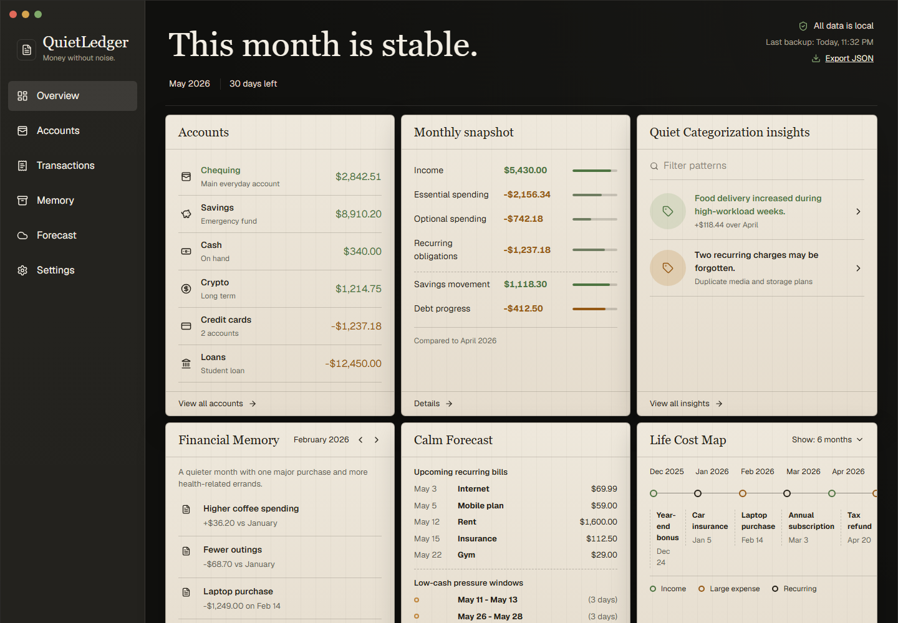
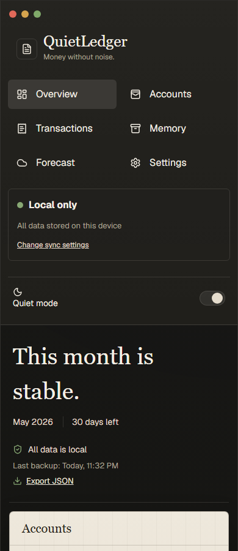
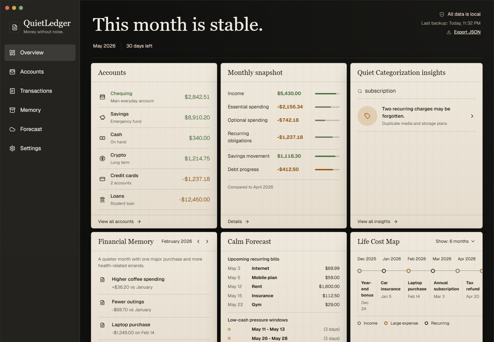

  <picture>
    <source media="(prefers-color-scheme: dark)" srcset="assets/branding/icon-source.png">
    
  </picture>
  <h1 align="center">OpenLedger</h1>
  

    <strong>A private, local-first personal finance ledger.</strong>
     
    No bank connections, no dashboards, no noise. Your financial data stays on your device.
  

   

  

 

 

---

## Gallery

  
  
    
  

 

---

## Why OpenLedger

Most finance tools want to connect to your bank, analyze your spending, and sell you insights. OpenLedger does none of that.

**It's a ledger — not a dashboard.** Enter transactions manually. Track accounts, budgets, and goals. Your data lives in your browser. Cloud backup is optional and opt-in. No analytics, no telemetry, no third-party data collection. No bank credentials or Plaid connections.

 

---

## Features

| | |
|---|---|
| **Accounts** — Checking, credit, savings, loan. Every transaction belongs to an account. | **Transactions** — Manual entry, edit, duplicate, delete. Search, filter, sort. |
| **CSV Import** — Bank statement CSV/TSV import with column mapping, preview, dedup. | **Budgets** — Monthly spending plans with progress tracking and over-budget warnings. |
| **Goals** — Savings milestones with target amounts and progress tracking. | **Recurring Entries** — Schedule-based recurring transaction engine with preview. |
| **Receipt Capture** — Photo upload from camera or gallery to Supabase Storage. | **Guest Mode** — Full local functionality without signing in. No account required. |
| **Cloud Sync** — Manual backup and restore to Supabase (opt-in). | **Search** — Global search with Quick Jump keyboard navigation. |
| **MCP Server** — AI agents can read/write your data via Model Context Protocol. | **PWA** — Installable as a standalone app with offline caching. |

 

---

## Designed For

**People who want a calm, honest view of their finances — no algorithms, no upsells.**

- **Budget-conscious individuals** tracking everyday spending against monthly plans
- **Freelancers** keeping simple income/expense records
- **Anyone tired of apps that try to sell them something while they check their balance

 

---

## Design Philosophy

> _"A calm finance tool — quiet, capable, private."_

No dashboards. No charts begging for attention. No push notifications. Local-first by design — your data lives in your browser unless you choose to back it up. Clean typography, generous spacing, dark-mode first. Every screen has one job.

 

---

## Built With

  
  
  
  
  
  
  

 

---

## Version Journey

| Version | Date | Highlights |
|---------|------|------------|
| **v0.11.0** | 2026-06 | Receipt capture, cloud sync, MCP server |
| **v0.10.0** | 2026-05 | Goals, recurring entries, CSV import engine |
| **v0.9.0** | 2026-05 | Budgets, search with Quick Jump |
| **v0.8.0** | 2026-04 | Guest mode, PWA readiness |
| **v0.7.0** | 2026-04 | Transaction search, filters, sortable columns |
| **v0.6.0** | 2026-03 | Multi-account support, CSV import |
| **v0.5.0** | 2026-03 | Accounts, transaction CRUD |
| **v0.4.0** | 2026-02 | IndexedDB persistence, local-first architecture |
| **v0.3.0** | 2026-02 | TypeScript migration, Tailwind CSS |
| **v0.2.0** | 2026-01 | Basic ledger UI, manual entry |
| **v0.1.0** | 2026-01 | Initial prototype |

[Full Changelog](CHANGELOG.md)

 

---

## License

AGPL-3.0-or-later — see [LICENSE](LICENSE)

Built by [@sparshsam](https://github.com/sparshsam)

 

---

## Part of the Open Collection

  <table>
    <tr>
      <td align="center" width="200">
         
        <strong>OpenPalette</strong> 
        A color studio for designers 
        <a href="https://github.com/sparshsam/openpalette">Repo</a> ·
        <a href="https://palette.kovina.org">Web</a>
      </td>
      <td align="center" width="200">
         
        <strong>OpenSend</strong> 
        Free file sharing, no account needed 
        <a href="https://github.com/sparshsam/opensend">Repo</a> ·
        <a href="https://send.kovina.org">Web</a>
      </td>
      <td align="center" width="200">
         
        <strong>OpenSprout</strong> 
        Plant care records 
        <a href="https://github.com/sparshsam/opensprout">Repo</a> ·
        <a href="https://sprout.kovina.org">Web</a>
      </td>
      <td align="center" width="200">
         
        <strong>OpenTone</strong> 
        Offline music library 
        <a href="https://github.com/sparshsam/OpenTone">Repo</a>
      </td>
    </tr>
  </table>

  <a href="https://github.com/sparshsam?tab=repositories&q=open&type=public">View all Open* repositories →</a>

